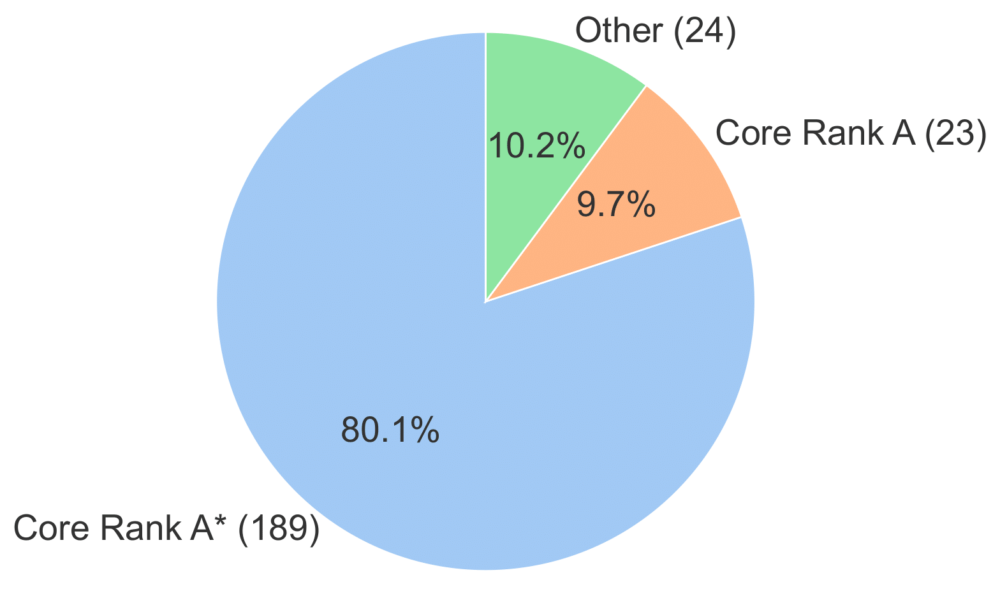
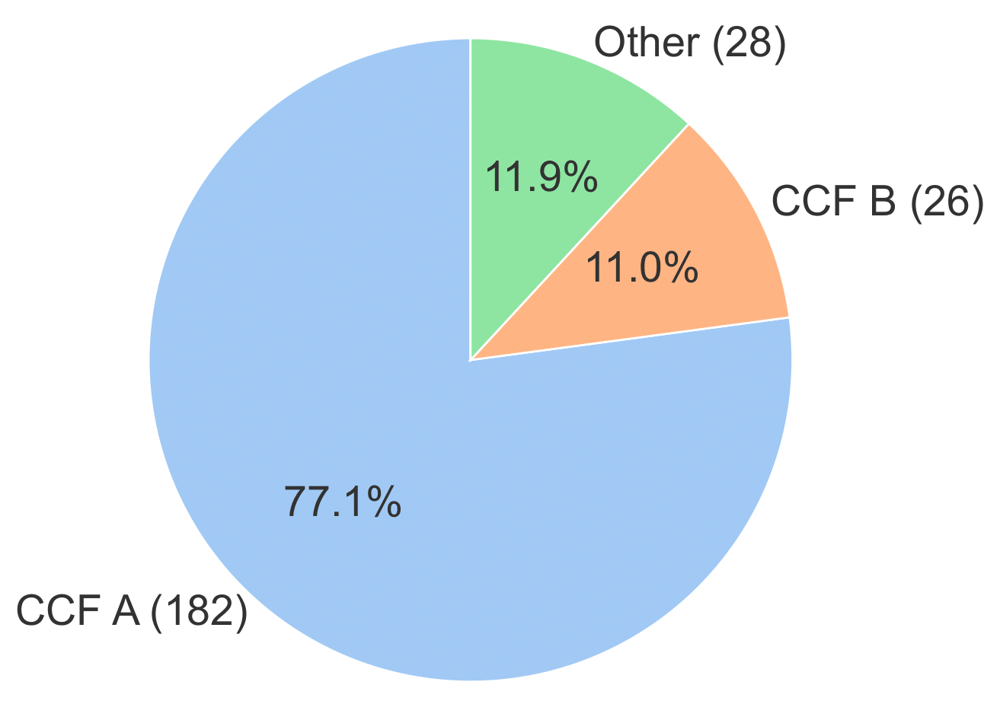

# Testing Techniques for Deep Learning Systems

## Core Rank and CCF Distribution
|  |  |
|----------------------------------|-----------------------------|

## Table of Contents
- [Efficiency-Oriented Testing Techniques](#efficiency-oriented-testing-techniques)
- [Testing Techniques for Robustness and Security](#testing-techniques-for-robustness-and-security)
- [Fairness-Oriented Testing Techinques](#fairness-oriented-testing-techinques)
- [Interpretability-Oriented Testing Techniques](#interpretability-oriented-testing-techniques)
- [Correctness-Oriented Testing Techniques](#correctness-oriented-testing-techniques)
- [Privacy-Oriented Testing Techniques](#privacy-oriented-testing-techniques)
- [Testing Techinques for Large Language Models](#testing-techinques-for-large-language-models)

## Efficiency-Oriented Testing Techniques
| Year | Title | Venue |
|:---------:|-------|:---------:|
|2025|Prioritizing speech test cases|TOSEM|
|2025|Markov model based coverage testing of deep learning software systems|IST|
|2024|Distance-aware test input selection for deep neural networks|ISSTA|
|2024|Criticalfuzz: A critical neuron coverage-guided fuzz testing framework for deep neural networks|IST|
|2024|Coverage-enhanced fault diagnosis for deep learning programs: A learning-based approach with hybrid metrics|IST|
|2024|Test input prioritization for 3d point clouds|TOSEM|
|2024|Aetta: Label-free accuracy estimation for test-time adaptation|CVPR|
|2024|Deepsample: Dnn sampling-based testing for operational accuracy assessment|ICSE|
|2024|Fast: Boosting uncertainty-based test prioritization methods for neural networks via feature selection|ASE|
|2023|Gnnevaluator: Evaluating gnn performance on unseen graphs without labels|NeurIPS|
|2023|Certpri: certifiable prioritization for deep neural networks via movement cost in feature space|ASE|
|2023|Evaluating surprise adequacy for deep learning system testing|TOSEM|
|2023|Aries: Efficient testing of deep neural networks via labeling-free accuracy estimation|ICSE|
|2023|Graphprior: Mutation-based test input prioritization for graph neural networks|TOSEM|
|2023|Actgraph: prioritization of test cases based on deep neural network activation graph|ASE|
|2022|Adaptive test selection for deep neural networks|ICSE|
|2022|Adaptive test selection for deep neural networks|ICSE|
|2022|Hybridrepair: towards annotation-efficient repair for deep learning models|ISSTA|
|2022|In Defense of Core-set: A Density-aware Core-set Selection for Active Learning|KDD|
|2022|An empirical study on data distribution-aware test selection for deep learning enhancement|TOSEM|
|2022|To actively initialize active learning|PR|
|2022|A white-box testing for deep neural networks based on neuron coverage|TNNLS|
|2022|Npc: Neuron path coverage via characterizing decision logic of deep neural networks|TOSEM|
|2022|Active learning for domain adaptation: An energy-based approach|AAAI|
|2022|Simple techniques work surprisingly well for neural network test prioritization and active learning (replicability study)|ISSTA|
|2022|Boosting active learning via improving test performance|AAAI|
|2021|Efficient active learning for gaussian process classification by error reduction|NeurIPS|
|2021|A review and refinement of surprise adequacy|DeepTest|
|2021|Prioritizing test inputs for deep neural networks via mutation analysis|ICSE|
|2021|Selecting test inputs for DNNs using differential testing with subspecialized model instances|FSE|
|2021|Semi-supervised active learning with temporal output discrepancy|ICCV|
|2021|Batch active learning at scale|NeurIPS|
|2020|Multiple-boundary clustering and prioritization to promote neural network retraining|ASE|
|2020|Cost-effective testing of a deep learning model through input reduction|ISSRE|
|2020|Reducing dnn labelling cost using surprise adequacy: An industrial case study for autonomous driving|FSE|
|2020|Importance-driven deep learning system testing|ICSE|
|2020|Practical accuracy estimation for efficient deep neural network testing|TOSEM|
|2019|Learning Loss for Active Learning|CVPR|
|2019|Deephunter: a coverage-guided fuzz testing framework for deep neural networks|ISSTA|
|2019|Structural test coverage criteria for deep neural networks|TECS|
|2019|Tensorfuzz: Debugging neural networks with coverage-guided fuzzing|ICML|
|2019|Boostingoperational dnn testing efficiency through conditioning|FSE|
|2019|Guiding deep learning system testing using surprise adequacy|ICSE|
|2018|Deeptest: Automated testing of deep-neural-network-driven autonomous cars|ICSE|
|2018|Deepgauge: Multi-granularity testing criteria for deep learning systems|ASE|
|2018|Dlfuzz: Differential fuzzing testing of deep learning systems|FSE|
|2017|Deepxplore: Automated whitebox testing of deep learning systems|SOSP|
|2017|Deep bayesian active learning with image data|ICML|

## Testing Techniques for Robustness and Security
| Year | Title | Venue |
|:---------:|-------|:---------:|
|2025|Iterative generation of adversarial example for deep code models|ICSE|
|2025|Tapt: Test- time adversarial prompt tuning for robust inference in vision-language models|CVPR|
|2025|Aed-pada: Improving generalizability of adversarial example detec-tion via principal adversarial domain adaptation|TOMM|
|2025|Two is Better than One: Efficient Ensemble Defense for Robust and Compact Models|CVPR|
|2025|MOS-Attack: A Scalable Multi-objective Adversarial Attack Framework|CVPR|
|2024|Attack as detection: Using adversarial attack methods to detect abnormal examples|TOSEM|
|2024|On the duality between sharpness-aware minimization and adversarial training|ICML|
|2024|Improving robustness to corruptions with multiplicative weight perturbations|NeurIPS|
|2024|TabularBench: benchmarking adversarial robustness for tabular deep learning in real-world use-cases|NeurIPS|
|2024|Great score: Global robustness evaluation of adversarial perturbation using generative models|NeurIPS|
|2024|Interpretability-guided test-time adversarial defense|ECCV|
|2024|Vulnerabilities in AI Code Generators: Exploring Targeted Data Poisoning Attacks|ICPC|
|2024|Superdeepfool: a new fast and accurate minimal adversarial attack|NeurIPS|
|2024|BrainWash: A Poisoning Attack to Forget in Continual Learning|CVPR|
|2023|Deeprover: A query-efficient blackbox attack for deep neural networks|FSE|
|2023|A comprehensive evaluation framework for deep model robustness|PR|
|2023|Fedslice: Protecting federated learning models from malicious participants with model slicing|ICSE|
|2023|Model poisoning attack on neural network without reference data|TC|
|2023|Adversarial parameter attack on deep neural networks|ICML|
|2023|A Tale of Two Approximations: Tightening Over-Approximation for DNN Robustness Verification via Under-Approximation|ISSTA|
|2023|Robust test selection for deep neural networks|TSE|
|2023|Understanding and improving ensemble adversarial defense|NeurIPS|
|2022|Toward improving the robustness of deep learning models via model transformation|ASE|
|2022|Adversarial robustness of deep code comment generation|TOSEM|
|2022|Eliminating Backdoor Triggers for Deep Neural Networks Using Attention Relation Graph Distillation|IJCAI|
|2022|You see what i want you to see: poisoning vulnerabilities in neural code search|FSE|
|2022|ε-weakened robustness of deep neural networks|ISSTA|
|2022|On the limitations of stochastic pre-processing defenses|NeurIPS|
|2022|Evaluating the adversarial robustness of adaptive test-time defenses|ICML|
|2021|Detecting adversarial samples with graph-guided testing|ASE|
|2021|Understanding local robustness of deep neural networks under natural variations|FASE|
|2021|Robot: Robustness-oriented testing for deep learning systems|ICSE|
|2021|On interaction between aug- mentations and corruptions in natural corruption robustness|NeurIPS|
|2021|Deeppayload: Black-box backdoor attack on deep learning models through neural payload injection|ICSE|
|2021|Robustness of on-device models: Adversarial attack to deep learning models on android apps|ICSE|
|2021|The many faces of robustness: A critical analysis of out-of-distribution generalization|ICCV|
|2020|Towards characterizing adversarial defects of deep learning software from the lens of uncertainty|ICSE|
|2020|Testing dnn image classifiers for confusion & bias errors|ICSE|
|2020|Weight poisoning attacks on pretrained models|ACL|
|2020|Augmix: A simple data processing method to improve robustness and uncertainty|ICLR|
|2020|Fuzz testing based data augmentation to improve robustness of deep neural networks|ICSE|
|2020|Local model poisoning attacks to {Byzantine-Robust} federated learning|USENIX Security|
|2020|Reliable evaluation of adversarial robustness with an ensemble of diverse parameter-free attacks|ICML|
|2020|Robust-bench: a standardized adversarial robustness benchmark|arXiv|
|2020|Square attack: a query-efficient black-box adversarial attack via random search|ECCV|
|2019|Theoretically principled trade-off between robustness and accuracy|ICML|
|2019|Adversarial sample detection for deep neural network through model mutation testing|ICSE|
|2019|Benchmarking neural network robustness to common corruptions and perturbations|ICLR|
|2019|On evaluating adversarial robustness|arXiv|
|2018|Deeproad: Gan-based metamorphic testing and input validation framework for autonomous driving systems|ASE|
|2018|Feature squeezing: Detecting adversarial examples in deep neural networks|NDSS|
|2018|Ensemble adversarial training: Attacks and defenses|ICLR|
|2018|Pixeldefend: Leveraging generative models to understand and defend against adversarial examples|ICLR|
|2018|Poison frogs! targeted clean-label poisoning attacks on neural networks|NeurIPS|
|2018|Towards deep learning models resistant to adversarial attacks|ICLR|
|2018|Trojaning attack on neural networks|NDSS|
|2018|Model-reuse attacks on deep learning systems|CCS|
|2017|Magnet: a two-pronged defense against adversarial examples|CCS|
|2017|Badnets: Identifying vulnerabilities in the machine learning model supply chain|arXiv|
|2017|On the (statistical) detection of adversarial examples|arXiv|
|2017|Targeted backdoor attacks on deep learning systems using data poisoning|arXiv|
|2017|Towards evaluating the robustness of neural networks|S&P|
|2015|Explaining and harnessing adversarial examples|ICLR|

## Fairness-Oriented Testing Techinques
| Year | Title | Venue |
|:---------:|-------|:---------:|
|2025|Fairquant: Certifying and Quantifying Fairness of Deep Neural Networks|ICSE|
|2025|Towards fair medical ai: Adversarial debiasing of 3d ct foundation embeddings|arXiv|
|2024|Counterfactual fairness by combining factual and counterfactual predictions|NeurIPS|
|2024|Improving adversarial robust fairness via anti-bias soft label distillation|NeurIPS|
|2024|Improving the fairness of the min-max game in gans training|WACV|
|2024|Why don’t prompt-based fairness metrics correlate?|ACL|
|2024|Mind the graph when balancing data for fairness or robustness|NeurIPS|
|2024|Towards counterfactual fairness-aware domain generalization in changing environments|IJCAI|
|2024|Fairtune: Optimizing parameter efficient fine tuning for fairness in medical image analysis|ICLR|
|2024|What hides behind unfairness? exploring dynamics fairness in reinforcement learning|IJCAI|
|2023|Testsgd: Interpretable testing of neural networks against subtle group discrimination|TOSEM|
|2023|Latent imitator: Generating natural individual discriminatory instances for black-box fairness testing|ISSTA|
|2023|Biasasker: Measuring the bias in conversational ai system|FSE|
|2023|Information-theoretic testing and debugging of fairness defects in deep neural networks|ICSE|
|2023|Loss balancing for fair supervised learning|ICML|
|2023|Fairify: Fairness verification of neural networks|ICSE|
|2023|Lucid–gan: Conditional generative models to locate unfairness|xAI|
|2022|Neuronfair: Interpretable white-box fairness testing through biased neuron identification|ICSE|
|2022|Adaptive fairness improvement based on causality analysis|FSE|
|2022|Ruler: discrimi- native and iterative adversarial training for deep neural network fairness|FSE|
|2022|Astraea: Grammar-based fairness testing|TSE|
|2022|"I'm sorry to hear that": Finding New Biases in Language Models with a Holistic Descriptor Dataset|EMNLP|
|2022|Generating and controlling diversity in image search|WACV|
|2022|Flexible text generation for counterfactual fairness probing|arXiv|
|2022|Evaluatingand mitigating bias in image classifiers: A causal perspective using counterfactuals|WACV|
|2022|Adaptive fairness improvement based on causality analysis|FSE|
|2022|Maat: a novel ensemble approach to addressing fairness and performance bugs for machine learning software|FSE|
|2022|Fair and accurate age prediction using distribution aware data curation and augmentation|WACV|
|2021|Self-diagnosis and self- debiasing: A proposal for reducing corpus-based bias in nlp|TACL|
|2021|Fair attribute classification through latent space de-biasing|CVPR|
|2021|Counterfactual fairness with disentangled causal effect variational autoencoder|AAAI|
|2021|Fair feature distillation for visual recognition|CVPR|
|2021|Biasfinder: Metamorphic test generation to un- cover bias for sentiment analysis systems|TSE|
|2020|White-box fairness testing through adversarial sampling|ICSE|
|2020|Exploring racial bias within face recognition via per-subject adversarially-enabled data augmentation|CVPR|
|2020|Investigating gender bias in language models using causal mediation analysis|NeurIPS|
|2020|Metamorphic testing and certified mitigation of fairness violations in nlp models|IJCAI|
|2020|Deep fair clustering for visual learning|CVPR|
|2020|Fairway: a way to build fair ml software|FSE|
|2019|Repair: Removing representation bias by dataset resampling|CVPR|
|2018|Women also snowboard: Overcoming bias in captioning models|ECCV|
|2018|Mitigating unwanted biases with adversarial learning|AAAI|
|2018|Automated directed fairness testing|ASE|
|2018|Themis: Automatically testing software for discrimination|FSE|
|2017|Counterfactual fairness|NeurIPS|
|2017|Fairness testing: testing software for discrimination|FSE|
|2016|Equality of opportunity in supervised learning|NeurIPS|

## Interpretability-Oriented Testing Techniques
| Year | Title | Venue |
|:---------:|-------|:---------:|
|2025|Interpretable image classification via non-parametric part prototype learning|CVPR|
|2025|Tracefl: Interpretability-driven debugging in federated learning via neuron provenance|ICSE|
|2024|On the evaluation consistency of attribution-based explanations|ECCV|
|2024|Decix: Explain deep learning based code generation applications|FSE|
|2024|B-cosification: Transforming deep neural networks to be inherently interpretable|arXiv|
|2024|Inferring data preconditions from deep learning models for trustworthy prediction in deployment|ICSE|
|2023|A sea of words: An in-depth analysis of anchors for text data|AISTATS|
|2022|Counterfactual explanations for models of code|ICSE|
|2021|{NBDT}: Neural-backed decision tree|ICLR|
|2021|Explaining mispredictions of machine learning models using rule induction|FSE|
|2021|Neural additive models: Interpretable machine learning with neural nets|NeurIPS|
|2020|Regional tree regularization for interpretability in deep neural networks|AAAI|
|2019|What is one grain of sand in the desert? analyzing individual neurons in deep nlp models|AAAI|
|2019|This looks like that: deep learning for interpretable image recognition|NeurIPS|
|2018|Anchors: High-precision model-agnostic explanations|AAAI|
|2017|Training differentiable models by constraining their explanations|IJCAI|
|2017|Understanding black-box predictions via influence functions|ICML|
|2016|Explaining the predictions of any classifier|KDD|

## Correctness-Oriented Testing Techniques
| Year | Title | Venue |
|:---------:|-------|:---------:|
|2024|D3: Differential Testing of Distributed Deep Learning with Model Generation|TSE|
|2023|Simulator-based explanation and debugging of hazard-triggering events in dnn-based safety-critical systems|TOSEM|
|2022|Metamorphic testing of deep learning compilers|POMACS|
|2022|Muffin: Testing deep learning libraries via neural architecture fuzzing|ICSE|
|2021|Mlcheck– property-driven testing of machine learning classifiers|ICMLA|
|2020|Metamorphic object insertion for testing object detection systems|ASE|
|2020|Deep learning library testing via effective model generation|FSE|
|2020|Oracle issues in machine learning and where to find them|ICSE|
|2020|Deepgini: prioritizing massive tests to enhance the robustness of deep neural networks|ISSTA|
|2019|Cradle: cross-backend validation to detect and localize bugs in deep learning libraries|ICSE|
|2018|Formal specification for deep neural networks|ATVA|
|2018|Identifying implementation bugs in machine learning based image classifiers using metamorphic testing|ISSTA|

## Privacy-Oriented Testing Techniques
| Year | Title | Venue |
|:---------:|-------|:---------:|
|2025|From Head to Tail: Efficient Black-box Model Inversion Attack via Long-tailed Learning|CVPR|
|2024|Can graph neural networks expose training data properties? an efficient risk assessment approach|NeurIPS|
|2024|You only query once: an efficient label-only membership inference attack|ICLR|
|2024|{ModelGuard}:{Information-Theoretic} defense against model extraction attacks|USENIX Security|
|2020|The secret revealer: Generative model-inversion attacks against deep neural networks|CVPR|
|2020|Gan-leaks: A taxonomy of membership inference attacks against generative models|CCS|
|2018|Property inference attacks on fully connected neural networks using permutation invariant representations|CCS|
|2017|Membership inference attacks against machine learning model|SP|
|2016|Stealing machine learning models via prediction {APIs}|USENIX Security|
|2015|Model inversion attacks that exploit confidence information and basic countermeasures|CCS|

## Testing Techinques for Large Language Models
| Year | Title | Venue |
|:---------:|-------|:---------:|
|2025|KG-FPQ: Evaluating factuality hallucination in LLMs with knowledge graph-based false premise questions|COLING|
|2025|Safetyquizzer: Timely and dynamic evaluation on the safety of llms|NAACL|
|2025|Benchmarking large language models for biomedical natural language processing applications and recommendations|Nature communications|
|2024|Do-not-answer: Evaluating safeguards in LLMs|EACL|
|2024|Plug-and-play performance estimation for llm services without relying on labeled data|ICSOC|
|2024|Examining the robustness of llm evaluation to the distributional assumptions of benchmarks|ACL|
|2024|tinybenchmarks: evaluating llms with fewer examples|ICML|
|2024|The dawn after the dark: An empirical study on factuality hallucination in large language models|ACL|
|2024|ART: Automatic red-teaming for text-to-image models to protect benign users|NeurIPS|
|2024|Mathador-LM: A dynamic benchmark for mathematical reasoning on large language models|EMNLP|
|2024|Pruning multilingual large language models for multilingual inference|EMNLP|
|2024|Evaluating the elementary multilingual capabilities of large language models with MultiQ|ACL|
|2024|Bias and fairness in large language models: A survey|Computational Linguistics|
|2024|LawBench: Bench- marking legal knowledge of large language models|EMNLP|
|2024|Fairness in large language models in three hours|CIKM|
|2024|Fairness in Large Language Models: A Taxonomic Survey|SIGKDD Explor. Newsl.|
|2023|Least-to-most prompting enables complex reasoning in large language models|ICLR|
|2023|Decodingtrust: A comprehensive assessment of trustworthiness in gpt models|NeurIPS|
|2023|Is chatgpt fair for recommendation? evaluating fairness in large language model recommendation|RecSys|
|2023|How predictable are large language model capabilities? a case study on BIG-bench|EMNLP|
|2023|Self-consistency improves chain of thought reasoning in language models|ICLR|
|2023|A comprehensive evaluation of large language models on legal judgment prediction|EMNLP|
|2023|Toolformer: Language models can teach themselves to use tools|NeurIPS|
|2023|ChatGPT MT: Competitive for high- (but not low-) resource languages|WMT|
|2023|Towards making the most of chatGPT for machine translation|EMNLP|
|2023|Is your code generated by chatgpt really correct? rigorous evaluation of large language models for code generation|NeurIPS|
|2023|Legalbench: A collaboratively built benchmark for measuring legal reasoning in large language models|NeurIPS|
|2023|Sparks of artificial general intelligence: Early experiments with gpt-4|arXiv|
|2023|A multitask, multilingual, multimodal evaluation of ChatGPT on reasoning, hallucination, and interactivity|AACL|
|2022|Chain-of-thought prompting elicits reasoning in large language models|NeurIPS|
|2022|TruthfulQA: Measuring how models mimic human falsehoods|ACL|
|2022|Holistic evaluation of language models|arXiv|
|2022|TRUE: Re-evaluating factual consistency evaluation|NAACL|
|2021|Adversarial glue: A multi-task benchmark for robustness evaluation of language models|NeurIPS|
|2021|Measuring massive multitask language understanding|ICLR|
|2021|Evaluating large language models trained on code|arXiv|